

 

 

 


<table>
<tr>
<td width="58%" valign="top">

Eu desenho coisa que precisa funcionar quando tem fila, quando o wi-fi cai e quando
alguém está com pressa. Web design, UI, UX e identidade visual desde 2019.

Comecei no design gráfico e fui parar no produto. O caminho foi esse porque a pergunta
que me interessa não é "que cor fica bonita aqui", é **"por que essa pessoa desistiu
nessa tela"**. Uma coisa leva à outra: para responder a segunda eu tive que aprender a
ler código, medir contraste de verdade e sentar do lado de quem usa.

Hoje eu faço as duas pontas. Desenho a marca, o produto e a interface, e depois
implemento. Não porque acho que designer tem que programar, mas porque **entrega que
passa por tradução perde coisa no caminho**, e eu prefiro não perder.

O desenho aqui do lado é como eu me vejo: fone, PSP, metrô, indo pra algum lugar.
A paleta deste perfil inteiro saiu dele, pixel por pixel. Explico mais abaixo.

</td>
<td width="42%" valign="top">

</td>
</tr>
</table>

 


### Party Pay

Um app para bar, festa e quermesse: você pede do celular, **racha a conta com a galera**,
paga por Pix e retira no balcão com um QR. Sem fila, sem comanda, sem "quem pagou o quê".

Fiz a marca, o produto, a interface, o site e o front. O racha é a parte da qual eu mais
gosto, porque é onde design e engenharia não dão para separar: cada pessoa tem uma cota
própria, com link que abre sem cadastro, e o pedido só vai para a cozinha quando a conta
fecha. Se a cota não somar o total no centavo, o racha não abre.

<table>
<tr>
<td width="25%">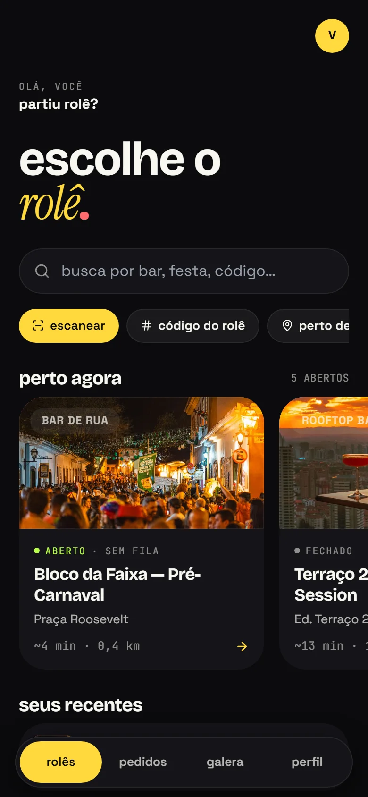</td>
<td width="25%">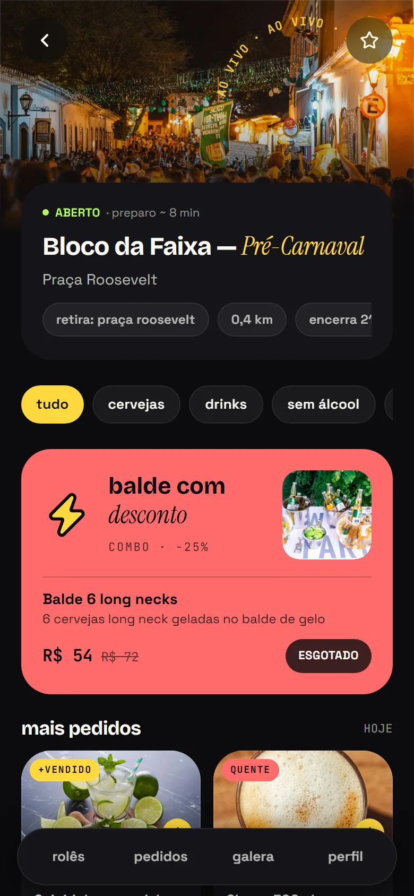</td>
<td width="25%">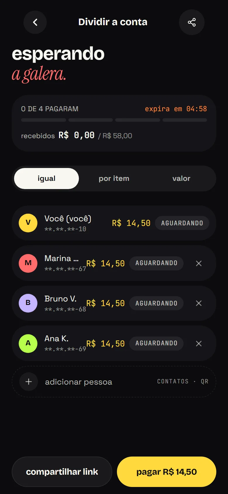</td>
<td width="25%">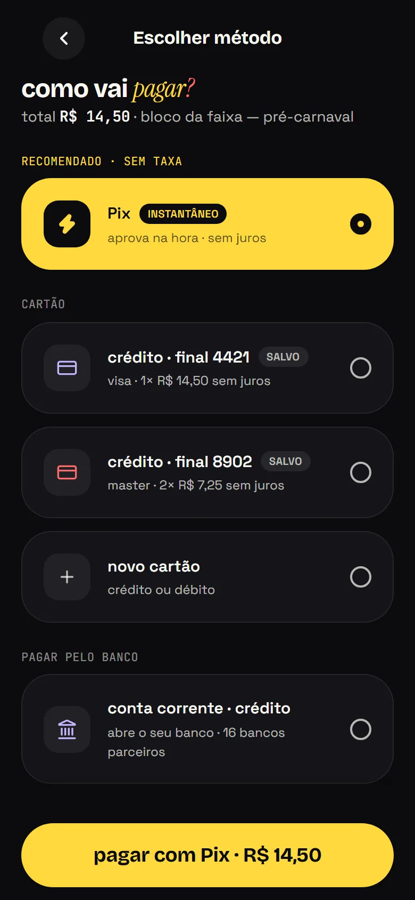</td>
</tr>
</table>

<table>
<tr>
<td width="50%">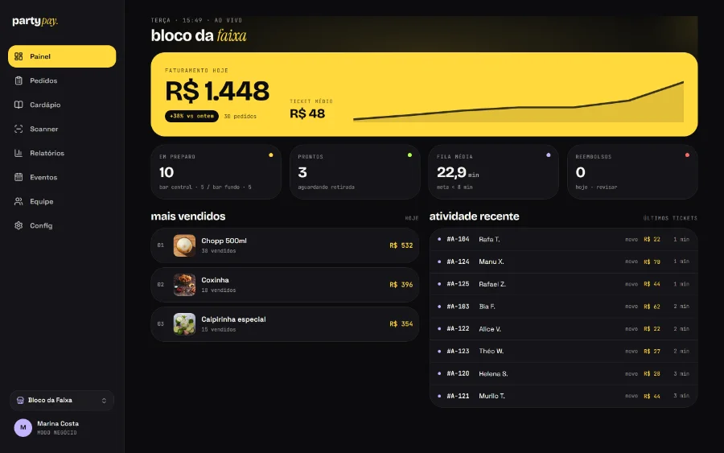</td>
<td width="50%">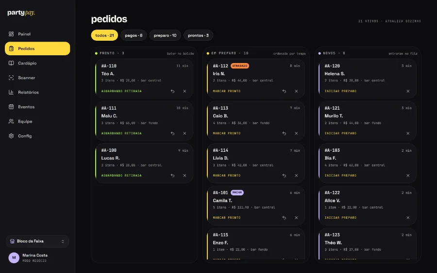</td>
</tr>
</table>

**React · TypeScript · Tailwind · Firebase · Cloud Functions · Vercel** — e um manual de
marca de verdade, com escala tipográfica, tokens e regra de contraste testada por script.

 



Nenhuma dessas cores foi escolhida no olho. Eu joguei a ilustração num canvas, amostrei
região por região e peguei a média de cada uma: o banco do vagão, a parede acesa, o boné,
o grafite do fundo. As amostras cruas vieram escuras demais para texto sobre preto, então
subi saturação e brilho até **cada uma passar no contraste do WCAG contra o `#0d1117`** que
o GitHub usa no modo escuro.

É assim que eu monto paleta em projeto sério também. Cor bonita que não passa no contraste
é cor que alguém não vai conseguir ler.

 

 

Esses dois se redesenham sozinhos a cada seis horas, numa Action. O cartão de números era um
serviço de terceiro até eu conferir e receber `503 DEPLOYMENT_PAUSED` — ele tinha saído do ar de
vez, e teria deixado dois retângulos quebrados aqui sem avisar ninguém. Agora os números vêm da
API do próprio GitHub e o desenho é meu.

 


 

**Tô sempre a fim de conversar sobre produto, marca e a parte chata que ninguém quer fazer.**

 

  

Este perfil não usa gerador de badge. O cabeçalho, os botões, a paleta, a fita de
ferramentas e os divisores são SVG que eu escrevi, com a tipografia convertida em contorno
vetorial e as animações em CSS dentro do próprio arquivo — porque SVG servido pelo GitHub
abre em modo estático seguro, onde script não roda e fonte web não carrega. 
O código que gera tudo isso está em <a href="./gerador">/gerador</a>.

 

